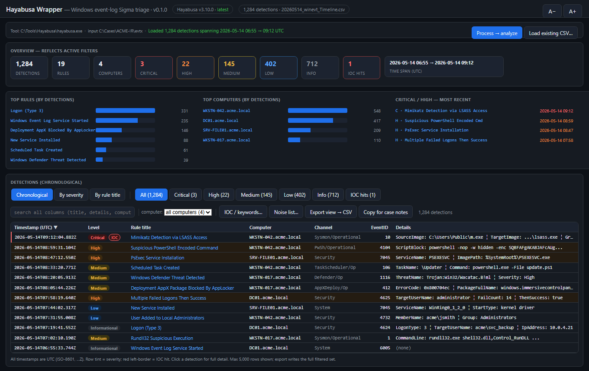
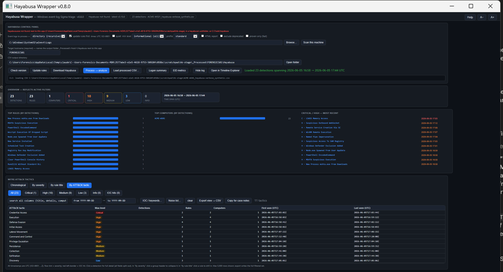

# Hayabusa Wrapper

A single-file, double-clickable **and command-line-invokable** GUI for triaging **Windows event logs** with [Yamato-Security Hayabusa](https://github.com/Yamato-Security/hayabusa), built for DFIR casework.

No install, no dependencies, no framework: one `.hta` that runs on any Windows box via the built-in `mshta.exe`. Point it at a live machine, a single `.evtx`, or a KAPE/Velociraptor collection tree; it runs `hayabusa csv-timeline` for you and turns the Sigma-detection CSV into an interactive, severity-aware triage view.





> Screenshots use fully synthetic data (fabricated host `ACME-WS01`, made-up detections) for illustration.

## Features

- **Runs Hayabusa for you** - file or recursive-directory mode; **updates the Sigma rules first by default** (`update-rules`), then runs `csv-timeline`. Async visible console so the UI never freezes. Forces `--no-wizard` (non-interactive), `--ISO-8601` (always-UTC `...Z` timestamps) and `-C` (clobber). Min-level defaults to **informational = see everything**. A **profile** selector (standard / verbose / super-verbose) controls how much context each detection carries.
- **Four synchronized views** of the same filtered set:
  - **Chronological** (default) - every detection, newest first.
  - **By severity** - collapsible Critical -> High -> Medium -> Low -> Informational groups (Critical/High expanded by default).
  - **By rule title** - aggregated: one row per rule with count, distinct computers, and first/last seen; drill into any rule.
  - **By ATT&CK tactic** - detections aggregated by **MITRE ATT&CK tactic**, ranked by max severity, with per-tactic counts and first/last seen. A single detection can map to several tactics; click a tactic to drill into its detections. This view appears when the run used the **verbose** profile (it adds the `MitreTactics` column), or when a loaded CSV already carries it.
- **Report & pivot tools**:
  - **HTML report** - tick the checkbox before processing to also write Hayabusa's own `-H` summary report next to the CSV, then **Open HTML report** to view it.
  - **EID metrics** / **Logon summary** - run those Hayabusa subcommands (`eid-metrics` / `logon-summary`) into a sortable grid for per-Event-ID counts and a logon overview.
  - **Open in Timeline Explorer** - hand the currently-loaded CSV straight to Eric Zimmerman's Timeline Explorer. It is auto-located under `Program Files`, `C:\Tools`, and the ZimmermanTools layouts (`C:\ZimmermanTools\...`, `C:\Tools\ZimmermanTools\...`, including the versioned `Net*\TimelineExplorer` folders), or a Desktop shortcut.
- **Severity-aware** - abbreviated Hayabusa levels (`crit`/`high`/`med`/`low`/`info`) normalized, color-coded chips and row tint, per-level counts.
- **Overview dashboard** - dataset stats (detections, rules, computers, per-level counts, time span), top rules by detections, top computers, and a critical/high most-recent hotlist, all recomputed under the active filters and clickable.
- **IOC / keyword list** - paste or load terms; matched case-insensitively against rule title, details, extra fields, computer, channel and rule id; matches score +3 and light up red.
- **Noise / known-FP list** - a separate loadable list to suppress environment-specific false positives (keep them here, not baked into the tool).
- **Filters** - level buttons with live counts, free-text search across all columns, computer filter, UTC date range.
- **Resizable columns** - drag a column-header edge to resize; widths are remembered per view (chronological / severity / rule-title / tactic / generic) across restarts; double-click the edge to reset.
- **Detail pane** - click any detection: every field split out, `Details` / `ExtraFieldInfo` broken into their ` ¦ `-joined sub-fields, IOC substrings highlighted; MITRE tactics shown as chips; verbose/super-verbose profile extra columns surfaced automatically.
- **Reporting** - export the filtered view (any view) to CSV, or copy formatted lines for case notes.
- **Command-line invocation** - `mshta Hayabusa-Wrapper.hta "<inputOrCsv>" ["<outDir>"] [/auto]` - hand it a pre-made CSV to open straight to the viewer, or an `.evtx` folder with `/auto` to process then display. Built so the [DFIR Windows Artifact Finder](https://github.com/bpmorris22/DFIR-Windows-Artifact-Finder) can drive it.

## Quick start

1. Put `Hayabusa-Wrapper.hta` next to `hayabusa.exe` (with its `rules\` + `config\` folders) - or in a folder containing a `hayabusa\` subfolder, or with Hayabusa at `C:\Tools\hayabusa`.
2. Double-click it. **Download Hayabusa** fetches and installs the latest build next to the app - architecture auto-detected (**win-x64** / **win-aarch64**), with `rules\` + `config\` included. Use **Update rules** any time to refresh the Sigma ruleset.
3. Point the input at an event-log source and click **Process -> analyze**:
   - `C:\Windows\System32\winevt\Logs` for the live machine (**run elevated**),
   - a collected `winevt\Logs` (or any `.evtx` tree) from a KAPE / Velociraptor collection,
   - or a single `.evtx`.
   - Tick **verbose** in the profile selector to populate the **By ATT&CK tactic** view.
4. Or **Load existing CSV...** to analyze a Hayabusa `csv-timeline` CSV you already have. Non-timeline CSVs (logon-summary, metrics) open in a generic sortable grid.

## Command line

```
mshta.exe "Hayabusa-Wrapper.hta" "<input>" ["<outDir>"] [/auto] [/min:LEVEL] [/profile:NAME] [/from:yyyy-MM-dd] [/to:yyyy-MM-dd]
```
- `<input>` - a `.csv` (auto-loaded into the viewer) or an `.evtx` file / directory (prefilled; processed if `/auto`).
- `<outDir>` - CSV output directory (optional; defaults to `_Processed\<host>\Hayabusa` next to the app).
- **Target hostname** is required before processing - it names the `_Processed\<host>\Hayabusa` output folder next to the app (family convention shared with the DFIR-Windows-Artifact-Finder, so processed evidence is visible per host per tool). Guessed from `Collection-<host>-...` paths, a passed `_Processed\<host>\` outDir, or this machine's name for live paths - overwrite the guess if it's wrong.
- **Shared IOC list** - an `IOC.txt` next to the app (one term per line, `#` comments) is auto-merged into the IOC box at launch; one list covers the whole toolkit and terms you paste locally are kept.
- **Run provenance + triage summary** - every successful run appends a `runinfo.json` entry (app, host, input path, files) in the output folder, including a triage summary (detections, crit/high/med/low counts, top rules); the DFIR-Windows-Artifact-Finder shows these per host in its inventory, even for standalone runs.
- `/auto` - process immediately (evtx input only).
- `/min:LEVEL` - minimum Hayabusa level (`informational` / `low` / `medium` / `high` / `critical`).
- `/profile:NAME` - Hayabusa output profile (`standard` / `verbose` / `super-verbose`); use **verbose** to populate the ATT&CK-tactic view.
- `/from:yyyy-MM-dd` `/to:yyyy-MM-dd` - case window (UTC, inclusive): prefills the date filter and is recorded in `runinfo.json`; never affects scoring. The [DFIR-Windows-Artifact-Finder](https://github.com/bpmorris22/DFIR-Windows-Artifact-Finder) passes these on every launch.

## Notes & limitations

- **Timestamps are always UTC** (`--ISO-8601`), shown with a `...Z` suffix - deliberately no local-time conversion, so times are unambiguous across analysts and time zones.
- **The ATT&CK-tactic view needs MITRE data.** Hayabusa only emits the `MitreTactics` column under the **verbose** (or super-verbose) profile - run with that profile, or load a verbose CSV, to populate the view. The standard profile leaves it empty and the view says so.
- Hayabusa only detects what its **Sigma ruleset** covers and what the collected channels contain - absence of a detection is not absence of activity. Keep rules updated.
- Large timelines (hundreds of thousands of detections) are display-capped (6,000 rows, with an amber "Warning: Maximum Rows Exceeded" chip when the cap bites) on the flat/severity views; **exports write the full filtered set**, and the **By rule title** / **By ATT&CK tactic** views are the scalable lenses.
- The ` ¦ ` sub-field separator is non-ASCII; running from a **network location** triggers an ANSI fallback that can mojibake it - splitting is handled defensively, but run from a **local** path for full fidelity.
- Velociraptor URL-encoded paths (`C%3A`) are handled.
- Hayabusa is arch-specific (**win-x64** vs **win-aarch64**) - pick the matching binary; rules are arch-independent.

## Credits

- [Yamato Security](https://github.com/Yamato-Security/hayabusa) for Hayabusa and its Sigma-based detection engine - this is an unaffiliated wrapper; all detection credit is theirs.

## License

MIT License - Copyright (c) 2026 Ben Morris
