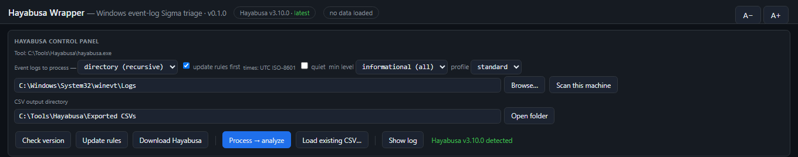

# Hayabusa Wrapper

A single-file, double-clickable **and command-line-invokable** GUI for triaging **Windows event logs** with [Yamato-Security Hayabusa](https://github.com/Yamato-Security/hayabusa) — built for DFIR casework.

No install, no dependencies, no framework: one `.hta` that runs on any Windows box via the built-in `mshta.exe`. Point it at a live machine, a single `.evtx`, or a KAPE/Velociraptor collection tree; it runs `hayabusa csv-timeline` for you and turns the Sigma-detection CSV into an interactive, severity-aware triage view.




> Screenshots use synthetic data (fabricated hosts and rules) for illustration.

## Features

- **Runs Hayabusa for you** — file or recursive-directory mode; **updates the Sigma rules first by default** (`update-rules`), then runs `csv-timeline`. Async visible console so the UI never freezes. Forces `--no-wizard` (non-interactive), `--ISO-8601` (always-UTC `…Z` timestamps) and `-C` (clobber). Min-level defaults to **informational = see everything**.
- **Three synchronized views** of the same filtered set:
  - **Chronological** (default) — every detection, newest first.
  - **By severity** — collapsible Critical → High → Medium → Low → Informational groups (Critical/High expanded by default).
  - **By rule title** — aggregated: one row per rule with count, distinct computers, and first/last seen; drill into any rule.
- **Severity-aware** — abbreviated Hayabusa levels (`crit`/`high`/`med`/`low`/`info`) normalized, color-coded chips and row tint, per-level counts.
- **IOC / keyword list** — paste or load terms; matched case-insensitively against rule title, details, extra fields, computer, channel and rule id; matches score +3 and light up red.
- **Noise / known-FP list** — a separate loadable list to suppress environment-specific false positives (keep them here, not baked into the tool).
- **Filters** — level buttons with live counts, free-text search across all columns, computer filter, UTC date range.
- **Detail pane** — click any detection: every field split out, `Details` / `ExtraFieldInfo` broken into their ` ¦ `-joined sub-fields, IOC substrings highlighted; verbose/super-verbose profile extra columns surfaced automatically.
- **Reporting** — export the filtered view (any view) to CSV, or copy formatted lines for case notes.
- **Command-line invocation** — `mshta Hayabusa-Wrapper.hta "<inputOrCsv>" ["<outDir>"] [/auto]` — hand it a pre-made CSV to open straight to the viewer, or an `.evtx` folder with `/auto` to process then display. Built so a separate artifact-finder can drive it.

## Quick start

1. Put `Hayabusa-Wrapper.hta` next to `hayabusa.exe` (with its `rules\` + `config\` folders) — or in a folder containing a `hayabusa\` subfolder, or with Hayabusa at `C:\Tools\hayabusa`.
2. Double-click it. **Download Hayabusa** fetches and installs the latest build next to the app — architecture auto-detected (**win-x64** / **win-aarch64**), with `rules\` + `config\` included. Use **Update rules** any time to refresh the Sigma ruleset.
3. Point the input at an event-log source and click **Process → analyze**:
   - `C:\Windows\System32\winevt\Logs` for the live machine (**run elevated**),
   - a collected `winevt\Logs` (or any `.evtx` tree) from a KAPE / Velociraptor collection,
   - or a single `.evtx`.
4. Or **Load existing CSV…** to analyze a Hayabusa `csv-timeline` CSV you already have. Non-timeline CSVs (logon-summary, metrics) open in a generic sortable grid.

## Command line

```
mshta.exe "Hayabusa-Wrapper.hta" "<input>" ["<outDir>"] [/auto] [/min:LEVEL] [/profile:NAME]
```
- `<input>` — a `.csv` (auto-loaded into the viewer) or an `.evtx` file / directory (prefilled; processed if `/auto`).
- `<outDir>` — CSV output directory (optional).
- `/auto` — process immediately (evtx input only).

## Notes & limitations

- **Timestamps are always UTC** (`--ISO-8601`), shown with a `…Z` suffix — deliberately no local-time conversion, so times are unambiguous across analysts and time zones.
- Hayabusa only detects what its **Sigma ruleset** covers and what the collected channels contain — absence of a detection is not absence of activity. Keep rules updated.
- Large timelines (hundreds of thousands of detections) are display-capped (5,000 rows) on the flat/severity views; **exports write the full filtered set**, and the **By rule title** view is the scalable lens.
- The ` ¦ ` sub-field separator is non-ASCII; running from a **network location** triggers an ANSI fallback that can mojibake it — splitting is handled defensively, but run from a **local** path for full fidelity.
- Velociraptor URL-encoded paths (`C%3A`) are handled.
- Hayabusa is arch-specific (**win-x64** vs **win-aarch64**) — pick the matching binary; rules are arch-independent.

## Credits

- [Yamato Security](https://github.com/Yamato-Security/hayabusa) for Hayabusa and its Sigma-based detection engine — this is an unaffiliated wrapper; all detection credit is theirs.

## License

MIT License — Copyright (c) 2026 Ben Morris
